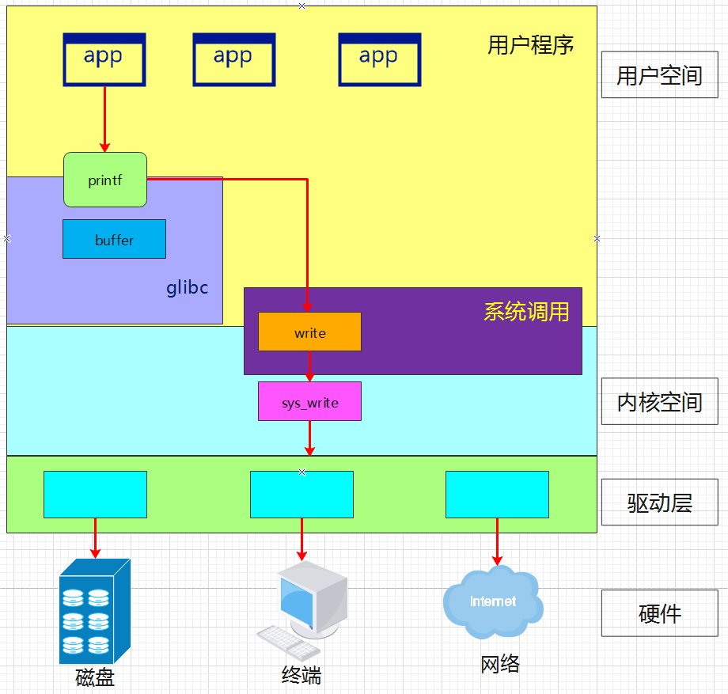

<!-- vscode-markdown-toc -->
* 1. [POSIX 標準](#POSIX)

<!-- vscode-markdown-toc-config
	numbering=true
	autoSave=true
	/vscode-markdown-toc-config -->
<!-- /vscode-markdown-toc -->

# Refernce
一些進階的參考資料。

##  1. POSIX 標準
POSIX（Portable Operating System Interface，可攜式作業系統介面）是一系列定義了操作系統介面標準的標準家族。其目的在於為不同的操作系統提供一致的應用程式程式接口 (API)，包括檔案系統操作、進程控制、信號處理、終端控制等，使得軟體可以輕鬆地移植到不同的平台上。

例如 `<termios.h>` 頭檔定義了與終端控制相關的函式和資料類型，使得開發者可以編寫與終端設備交互的程式，而無需關心底層操作系統的細節。

POSIX 兼容 是指接口函數兼容，例如 API的函數名、傳回值和參數類型等，但是不在乎 API 具體如何實現。例如 `glibc` 的 C library 就是基於 POSIX 標準來定義的。

以下是 POSIX 示意圖。
 